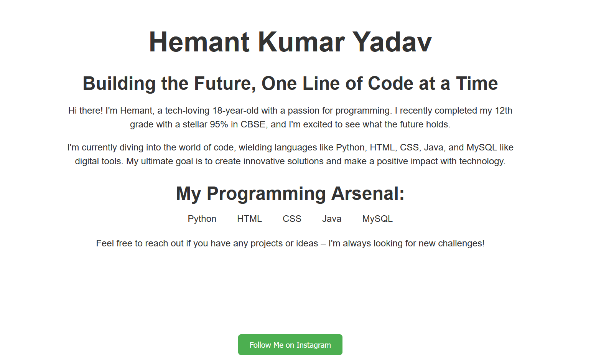

# Hemant Kumar Yadav - Personal Webpage

This repository contains the HTML code for my personal webpage, showcasing my skills, background, and interests.

## Introduction

Welcome to my personal webpage! This webpage serves as a platform to showcase my skills, educational background, and interests in programming and technology.

## Contents

- `index.html`: The main HTML file containing the content and structure of the webpage.
- `style.css`: Optional CSS file for additional styling (not included in this repository).
- `images/`: Directory for storing images used on the webpage (not included in this repository).

## Preview

https://thehemantonly.github.io/personal-webpage/

## Usage

You can view the webpage by opening `index.html` in any web browser. Feel free to customize the content and styling according to your preferences.

## Technologies Used

- HTML
- CSS (Bootstrap)

## Author

- Name: Hemant Kumar Yadav
- Email: thehemantonly@gmail.com
- LinkedIn: https://www.linkedin.com/in/thehemantonly/
- GitHub: https://github.com/thehemantonly/

